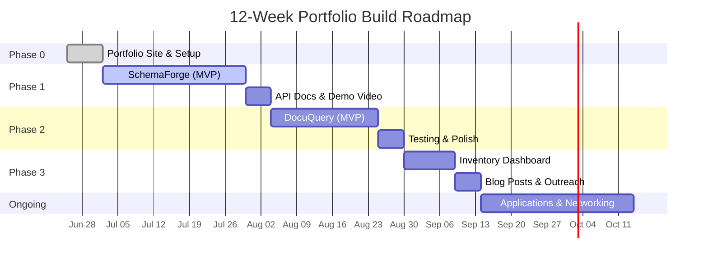

# 🗺️ Jared Dionela — Developer Roadmap & Employability Playbook

> **Target Role:** Backend / Full-Stack Web Developer
> **Core Stack:** Python/FastAPI (AI backends) · Next.js (full-stack web) · Supabase (PostgreSQL + pgvector) · Vercel
> **Domain Expertise:** Enterprise Databases · SAP B1 · Oracle · SQL Automation

---

## 1. Organized Roadmap

### Phase 0: Foundation Lock-In *(Now — Week 1)*

| Task | Purpose | Status |
|---|---|---|
| Finish portfolio website polish | First impression for recruiters | 🔄 In Progress |
| Set up AI Second Brain (Claude + Obsidian) | Organize learning & project context | ⬜ Not Started |
| Create a clean GitHub profile README | Shows professionalism immediately | ⬜ Not Started |
| Set up project templates (FastAPI + Next.js) | Reuse across all projects | ⬜ Not Started |

### Phase 1: First Portfolio Project *(Weeks 2–6)*

| Task | Purpose | Priority |
|---|---|---|
| **Build SchemaForge** (see §2.1) | Flagship AI + Backend project | 🔴 Critical |
| Deploy backend to Railway/Render | Live demo for recruiters | 🔴 Critical |
| Deploy frontend to Vercel | Clean, fast public URL | 🔴 Critical |
| Write API documentation (OpenAPI/Swagger) | Shows enterprise-readiness | 🟡 High |
| Record a 2-min Loom demo walkthrough | Recruiters won't clone your repo | 🟡 High |

### Phase 2: Second Portfolio Project *(Weeks 7–10)*

| Task | Purpose | Priority |
|---|---|---|
| **Build DocuQuery** (see §2.2) | Proves RAG depth + document processing | 🔴 Critical |
| Implement Supabase RLS policies | Shows security awareness | 🟡 High |
| Add end-to-end tests (Playwright) | Demonstrates quality standards | 🟢 Medium |

### Phase 3: Polish & Ship *(Weeks 11–12)*

| Task | Purpose | Priority |
|---|---|---|
| **Build Real-Time Dashboard** (see §2.3) | Quick win, visually impressive | 🟡 High |
| Update portfolio site with live project cards | Replace "Coming Soon" placeholders | 🔴 Critical |
| Write 1-2 dev blog posts (Hashnode/Dev.to) | SEO + thought leadership | 🟢 Medium |
| Begin cold outreach & applications | The actual goal | 🔴 Critical |

### Phase 4: Continuous Growth *(Ongoing)*

| Task | Purpose | Priority |
|---|---|---|
| Contribute to 1 open-source project | Shows collaboration skills | 🟢 Medium |
| Get AWS/GCP cloud certification | Enterprise credibility | 🟢 Medium |
| Build FlowPilot (ambitious stretch) | Senior-level portfolio piece | ⚪ Stretch |

---

## 2. Portfolio Project Proposals

> [!IMPORTANT]
> Each project is designed to fill a specific "proof point" that hiring managers look for. Together, they form a complete narrative: *"This developer can design schemas, build APIs, integrate AI, and ship production-quality full-stack applications."*

---

### 2.1 🔧 SchemaForge — AI Database Migration & Query Agent

**What it proves:** *"I deeply understand databases AND I can build AI-augmented developer tools."*

#### Elevator Pitch
Paste any database schema (Oracle, MySQL, PostgreSQL DDL) → SchemaForge analyzes it for anti-patterns, generates cross-dialect migration scripts, and lets you query your data in plain English.

#### Stack
| Layer | Technology | Why |
|---|---|---|
| Frontend | Next.js (Vercel) | Full-stack React framework with Monaco editor for SQL |
| Backend API | Python + FastAPI | Async, auto-generated OpenAPI docs, ideal for AI integration |
| Database | Supabase (PostgreSQL + pgvector) | Schema storage + vector embeddings for NL queries |
| AI | Gemini 2.5 Flash API | Schema analysis, SQL generation, NL→SQL |
| Auth | Supabase Auth | Row-level security per user |

#### Key Features (MVP)
1. **Schema Analyzer** — Upload DDL → AI identifies missing indexes, naming inconsistencies, denormalization opportunities
2. **Migration Generator** — Select source/target dialect → generates runnable migration SQL with validation
3. **Natural Language Querying** — "Show all users who placed orders this month" → generates SQL, explains it, displays results
4. **Schema History** — Version-controlled schema snapshots with diff views

#### Database Schema (Supabase)
```sql
-- Core tables
CREATE TABLE users (
  id UUID PRIMARY KEY DEFAULT gen_random_uuid(),
  email TEXT UNIQUE NOT NULL,
  created_at TIMESTAMPTZ DEFAULT now()
);

CREATE TABLE schemas (
  id UUID PRIMARY KEY DEFAULT gen_random_uuid(),
  user_id UUID REFERENCES users(id) ON DELETE CASCADE,
  name TEXT NOT NULL,
  source_dialect TEXT NOT NULL,  -- 'oracle', 'mysql', 'postgresql'
  raw_ddl TEXT NOT NULL,
  parsed_json JSONB,            -- Structured representation
  created_at TIMESTAMPTZ DEFAULT now()
);

CREATE TABLE schema_analyses (
  id UUID PRIMARY KEY DEFAULT gen_random_uuid(),
  schema_id UUID REFERENCES schemas(id) ON DELETE CASCADE,
  analysis_type TEXT NOT NULL,   -- 'anti_patterns', 'migration', 'optimization'
  result JSONB NOT NULL,
  ai_model TEXT,
  created_at TIMESTAMPTZ DEFAULT now()
);

-- Vector embeddings for NL queries
CREATE TABLE schema_embeddings (
  id UUID PRIMARY KEY DEFAULT gen_random_uuid(),
  schema_id UUID REFERENCES schemas(id) ON DELETE CASCADE,
  chunk_text TEXT NOT NULL,       -- e.g., table description, column docs
  embedding VECTOR(768),          -- pgvector
  metadata JSONB
);
```

#### API Routes (FastAPI)
```
POST   /api/auth/login              → Supabase Auth
POST   /api/auth/register           → Supabase Auth

POST   /api/schemas                 → Upload & parse DDL
GET    /api/schemas                 → List user's schemas
GET    /api/schemas/{id}            → Get schema detail
DELETE /api/schemas/{id}            → Delete schema

POST   /api/schemas/{id}/analyze    → Run AI analysis
GET    /api/schemas/{id}/analyses   → List analyses for schema

POST   /api/schemas/{id}/migrate    → Generate migration to target dialect
POST   /api/schemas/{id}/query      → Natural language → SQL

GET    /api/health                  → Health check
```

#### Recruiter Impact
- Shows **database expertise** beyond CRUD
- Demonstrates **AI integration** with real utility (not a toy)
- Proves you can design **clean REST APIs** with proper auth

---

### 2.2 📄 DocuQuery — AI Document Intelligence Platform

**What it proves:** *"I can build production RAG systems with proper chunking, retrieval, and citation."*

#### Elevator Pitch
Upload contracts, SOWs, or policy documents. Ask questions in natural language. Get cited, grounded answers with exact paragraph references.

#### Stack
| Layer | Technology |
|---|---|
| Frontend | Next.js (Vercel) |
| Backend API | Python + FastAPI |
| Database | Supabase (PostgreSQL + pgvector) |
| File Storage | Supabase Storage |
| AI | Gemini 2.5 Flash (embeddings + generation) |
| PDF Processing | PyMuPDF / pdfplumber (Python) |

#### Key Features (MVP)
1. **Document Upload & Chunking** — PDFs/Markdown → intelligent chunking with overlap
2. **Semantic Search** — pgvector cosine similarity across your document corpus
3. **Cited Q&A** — Every answer includes `[Source: contract-name.pdf, Page 3, ¶2]`
4. **Multi-Document Queries** — "Compare payment terms across all vendor agreements"
5. **Smart Alerts** — "Notify me 30 days before any contract expires"

#### Database Schema (Supabase)
```sql
CREATE TABLE documents (
  id UUID PRIMARY KEY DEFAULT gen_random_uuid(),
  user_id UUID REFERENCES users(id) ON DELETE CASCADE,
  title TEXT NOT NULL,
  file_path TEXT NOT NULL,         -- Supabase Storage path
  doc_type TEXT,                   -- 'contract', 'sow', 'invoice', 'policy'
  metadata JSONB,                  -- client, date, expiry, etc.
  status TEXT DEFAULT 'processing', -- 'processing', 'ready', 'error'
  created_at TIMESTAMPTZ DEFAULT now()
);

CREATE TABLE document_chunks (
  id UUID PRIMARY KEY DEFAULT gen_random_uuid(),
  document_id UUID REFERENCES documents(id) ON DELETE CASCADE,
  chunk_index INT NOT NULL,
  content TEXT NOT NULL,
  page_number INT,
  embedding VECTOR(768),
  metadata JSONB                   -- paragraph number, section heading
);

CREATE TABLE conversations (
  id UUID PRIMARY KEY DEFAULT gen_random_uuid(),
  user_id UUID REFERENCES users(id) ON DELETE CASCADE,
  title TEXT,
  created_at TIMESTAMPTZ DEFAULT now()
);

CREATE TABLE messages (
  id UUID PRIMARY KEY DEFAULT gen_random_uuid(),
  conversation_id UUID REFERENCES conversations(id) ON DELETE CASCADE,
  role TEXT NOT NULL,               -- 'user' or 'assistant'
  content TEXT NOT NULL,
  citations JSONB,                  -- [{doc_id, page, paragraph, snippet}]
  created_at TIMESTAMPTZ DEFAULT now()
);
```

#### Recruiter Impact
- RAG is **the #1 AI pattern in production** — proving you can build it properly is extremely high signal
- Shows understanding of **document processing pipelines** (chunking, embedding, retrieval)
- **Citation grounding** separates you from toy RAG demos

---

### 2.3 📊 Real-Time Inventory Dashboard

**What it proves:** *"I can build responsive, real-time full-stack applications with proper state management."*

#### Elevator Pitch
A sleek inventory management dashboard with real-time stock updates, role-based access, and automated low-stock alerts. Connects to Supabase Realtime for live data.

#### Stack
| Layer | Technology |
|---|---|
| Frontend | Next.js + Recharts (Vercel) |
| Backend | Supabase (PostgreSQL + Realtime + RLS + Edge Functions) |
| Auth | Supabase Auth (RBAC: admin, manager, viewer) |
| Notifications | Supabase Edge Functions → email/webhook |

#### Key Features (MVP)
1. **Live Dashboard** — Stock levels, order volume, and revenue charts updating in real-time
2. **RBAC** — Admins can modify, managers can approve, viewers can only read
3. **Low-Stock Alerts** — Database trigger fires when stock < threshold → Edge Function sends notification
4. **Order History** — Paginated, filterable, sortable order log
5. **CSV Export** — Download reports as CSV for accounting

#### Why This Project?
This is your **quick win**. It's faster to build (1-2 weeks), visually impressive for recruiters, and directly maps to your existing inventory management system in your portfolio. It upgrades the placeholder into a live, deployed application.

---

## 3. Productivity System

### 🔁 Daily Workflow

```
┌─────────────────────────────────────────────────┐
│  MORNING (30 min)                               │
│  ☐ Review yesterday's commits in GitHub         │
│  ☐ Pick 1-2 tasks from your task.md             │
│  ☐ Write a brief plan (what + why) before code  │
├─────────────────────────────────────────────────┤
│  DEEP WORK (2-4 hours)                          │
│  ☐ Code with Pomodoros (50 min on / 10 min off) │
│  ☐ Commit every meaningful change (not EOD)     │
│  ☐ Use conventional commits (feat:, fix:, etc.) │
├─────────────────────────────────────────────────┤
│  EVENING (15 min)                               │
│  ☐ Push all branches                            │
│  ☐ Update task.md with progress                 │
│  ☐ Write tomorrow's top 3 priorities            │
└─────────────────────────────────────────────────┘
```

### 🛠️ Tools

| Tool | Purpose | Why |
|---|---|---|
| **Obsidian** | Personal knowledge base & project notes | Graph view shows connections between ideas |
| **Linear / GitHub Projects** | Task tracking | Kanban board for each project |
| **Claude / Gemini (AI Second Brain)** | Context-aware coding assistant | Reduce boilerplate, accelerate debugging |
| **Excalidraw** | Architecture diagrams | Visual thinking before coding |
| **Loom** | Record project demos | Recruiters watch 2-min videos, they don't clone repos |

### 📐 Weekly Habits

| Day | Focus |
|---|---|
| **Monday** | Plan the week. Define 3 deliverables. |
| **Tue–Thu** | Deep work on primary project. |
| **Friday** | Code review your own PRs. Write docs. |
| **Saturday** | Side project or learning (optional). |
| **Sunday** | Rest. Or write a dev blog post. |

### 🚀 The "Ship Fast" Rules

1. **MVP first, polish later.** Get the core flow working end-to-end before adding edge cases.
2. **Deploy on Day 1.** Set up Vercel + Supabase before writing a single component. Deploying should never be a "later" task.
3. **Time-box exploration.** Give yourself 30 minutes to research a library. If it's not working, pick the simpler alternative.
4. **Commit messages are your resume.** `feat: implement NL-to-SQL pipeline with Gemini 2.5 Flash` tells a story. `update stuff` does not.
5. **One project at a time.** Finish SchemaForge before starting DocuQuery. Half-built projects are worse than no projects.

---

## 4. Employability Strategy

### 📋 GitHub Profile Optimization

**Your GitHub is your second resume.** Here's the checklist:

- [ ] **Profile README** — A clean `README.md` in a repo named after your username. Include: one-liner bio, tech stack badges, link to portfolio, link to resume.
- [ ] **Pinned Repos** — Pin your 3 best projects. Order: SchemaForge → DocuQuery → Inventory Dashboard.
- [ ] **Consistent Commit History** — Green squares matter. Aim for 4-5 commits/week minimum during your build phase.
- [ ] **Conventional Commits** — Use the format `type(scope): description`:
  ```
  feat(api): add schema analysis endpoint with Gemini integration
  fix(auth): resolve RLS policy leak on shared schemas
  docs(readme): add architecture diagram and setup instructions
  test(api): add integration tests for migration generator
  ```
- [ ] **Branch Strategy** — Use `main` (production) + `develop` (staging) + feature branches (`feat/nl-to-sql`).

### 📖 API Documentation Standards

Every backend project **must** have:

1. **OpenAPI/Swagger Spec** — Auto-generated by FastAPI (built-in). Hosted at `/docs`. For Next.js projects, use `next-swagger-doc`.
2. **README with Setup Instructions** — Clone → configure `.env` → run → test. Under 5 minutes.
3. **Architecture Decision Records (ADRs)** — Short markdown files explaining *why* you chose FastAPI over Express, why pgvector over Pinecone, etc. This shows **engineering maturity**.
4. **Postman/Bruno Collection** — Exported API collection that recruiters can import and test immediately.

### 🚀 Deployment Strategy

| Component | Platform | Why |
|---|---|---|
| Next.js Frontend | **Vercel** | Free tier, instant deploys, preview URLs per PR |
| Python/FastAPI API | **Railway** or **Render** | Free tier, easy Docker deploys, auto-scaling |
| Database | **Supabase** | Free tier, managed PostgreSQL + pgvector + Auth |
| File Storage | **Supabase Storage** | Integrated with RLS, no extra service |

**Pro tip:** Set up **GitHub Actions** for CI/CD. A `deploy.yml` that runs tests → builds → deploys on every push to `main` shows you understand DevOps fundamentals.

### 🎯 Resume & Application Strategy

1. **Tailor your resume per application.** Your portfolio site is the constant; your resume adapts.
2. **Lead with impact, not tasks.** ❌ "Built a RAG chatbot" → ✅ "Designed a document intelligence platform processing 500+ page contracts with citation-grounded AI responses, achieving 94% retrieval accuracy"
3. **Include live links.** Every project on your resume should have: `[Live Demo]` `[GitHub]` `[API Docs]`
4. **The 3-project rule.** Recruiters scan, they don't read. 3 excellent projects > 8 mediocre ones.

### 📝 Content & Visibility

| Action | Frequency | Platform |
|---|---|---|
| Write a "How I Built X" post | Per project | Dev.to / Hashnode |
| Share project launch | Per project | LinkedIn + Twitter/X |
| Engage with dev communities | Weekly | Reddit r/webdev, Discord servers |
| Answer Stack Overflow questions | 2x/month | Stack Overflow (in your domain) |

---

## Timeline Summary



---

> [!TIP]
> **The single most important thing:** Ship SchemaForge first. It's your flagship. Everything else builds on the momentum and confidence of completing that one project. Start this week.
